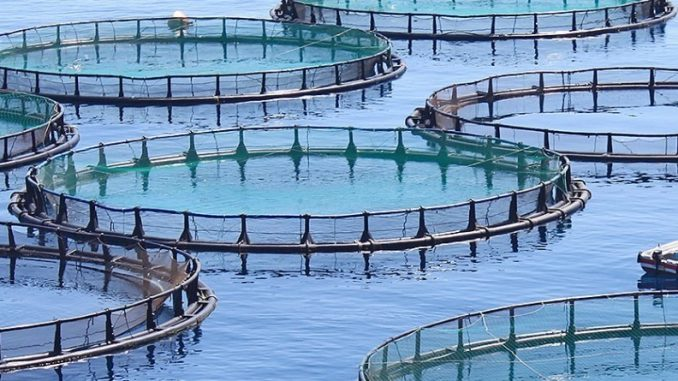

# tiposdepesca.github.io
Relatório Laboratório de Projeto I

**Peixe Produzido em Aquicultura**

Este projeto tem como intuito em apresentar dados de Pesca Extensiva, Intensiva e Semi-Intensiva em Portugal, de acordo com os valores do Pordata numa forma mais intuitiva e simples, de acordo com os anos 2000, 2005, 2010, 2015 e o ano mais atual 2019, até à data, utilizando o programa p5.js para fazer um *one page website* sobre a cultura do peixe em Portugal.

A ideia de criar este site é dar a conhecer aos utilizadores a diferença que tem de ano para ano de acordo com os três tópicos de Pesca Extensiva, Intensiva e Semi-Intensiva em Portugal e fazer esta comparação, já que existe uma diferença enorme entre eles, tendo em conta o impacto que cada um tem. 

- **Pesca Extensiva**: é a pesca mais usada, aquela que na produção do peixe não há controlo total sobre o processo, tratando-se de libertar os peixes no ambiente e utilizar os recursos que estão na natureza, se for bem gerida, pode ter um impacto positivo nos ecossistemas e ajudar a preservar a biodiversidade. 

- **Pesca Intensiva**: dá-se quando a captura de peixe nos mares e rios é maior que o tempo necessário para haver uma reposição natural da espécie. 

- **Pesca Semi-intensiva**: uma atividade de criação de diferentes espécies de peixe com foco na maximização da produção. O sistema pode ser implementado com tanques ou viveiros escavados no terreno, ou até mesmo em regiões propícias nas quais há depressões e pequenas barragens. Nesse sistema, os criadores fornecem uma alimentação natural do próprio viveiro e ração industrial aos animais.

Ao abrir o projeto, irá aparecer uma janela com o título e um peixe a mexer-se. Ao clicar no canto superior esquerdo irá dar acesso a outra janela onde irá explicar um pouco o que é a pesca e os seus três tópicos. Assim que passar por estes separadores, assim abrirá a página principal, onde contém um cenário que dá um efeito de cubo, onde existem três tipo de peixe com cores diferentes para puder identificar de qual categoria pertencem e de diferentes tamanhos, representando e comparando de forma qualitativa o quão os valores são diferentes de ano para ano e de pesca para pesca.

A criação deste trabalho foi usado o p5.js para todo o _processing_, o Photoshop para a imagem de fundo e o Blender na criação do modelo 3D dos peixes.

Fonte de recolha de informação contextual: 
- https://www.ine.pt/xportal/xmain?xpid=INE&xpgid=ine_publicacoes&PUBLICACOESpub_boui=31592402&PUBLICACOEStema=00&PUBLICACOESmodo=2
- https://www.dn.pt/ciencia/biosfera/mediterraneo-e-o-mar-mais-ameacado-do-planeta-1632757.html
- https://rea.apambiente.pt/content/produ%C3%A7%C3%A3o-em-aquicultura
- https://blog.sansuy.com.br/piscicultura-semi-intensiva/
- https://rea.apambiente.pt/content/produção-em-aquicultura
- https://www.ine.pt/xportal/xmain?xpid=INE&xpgid=ine_publicacoes&PUBLICACOESpub_boui=31592402&PUBLICACOEStema=00&PUBLICACOESmodo=2

Imagem: https://otc.pt/wp/2016/08/07/aquacult/

Fonte de recolha dos dados: 
- https://www.pordata.pt/db/portugal/ambiente+de+consulta/tabela
- https://www.pordata.pt/portugal/peixe+produzido+em+aquicultura+total+e+por+principais+especies-3454-309758a+total+e+por+principais+especies-3454-309758

[Tabela de dados](assets/dataset.csv)

Trabalho realizado por:
* **André Ribeiro** - 3200750
* **Maria Juvandes** - 3200715

* **Semestre:** 1º
* **Discplina:** Laboratório de Projeto I
* **Licenciatura:** Design Gráfico e Multimédia
* **Universidade:** Escola Superior de Artes e Design, Caldas da Raínha
* **Professor:** Marco Heleno
* **Último momento de Avaliação:** 11 dezembro de 2022

